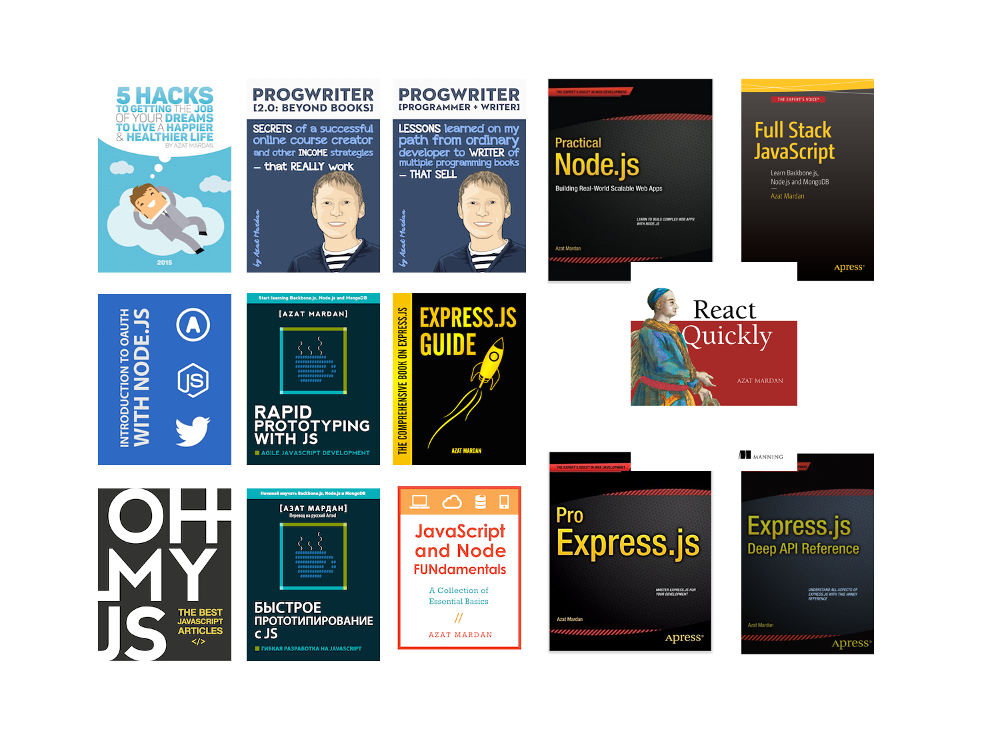
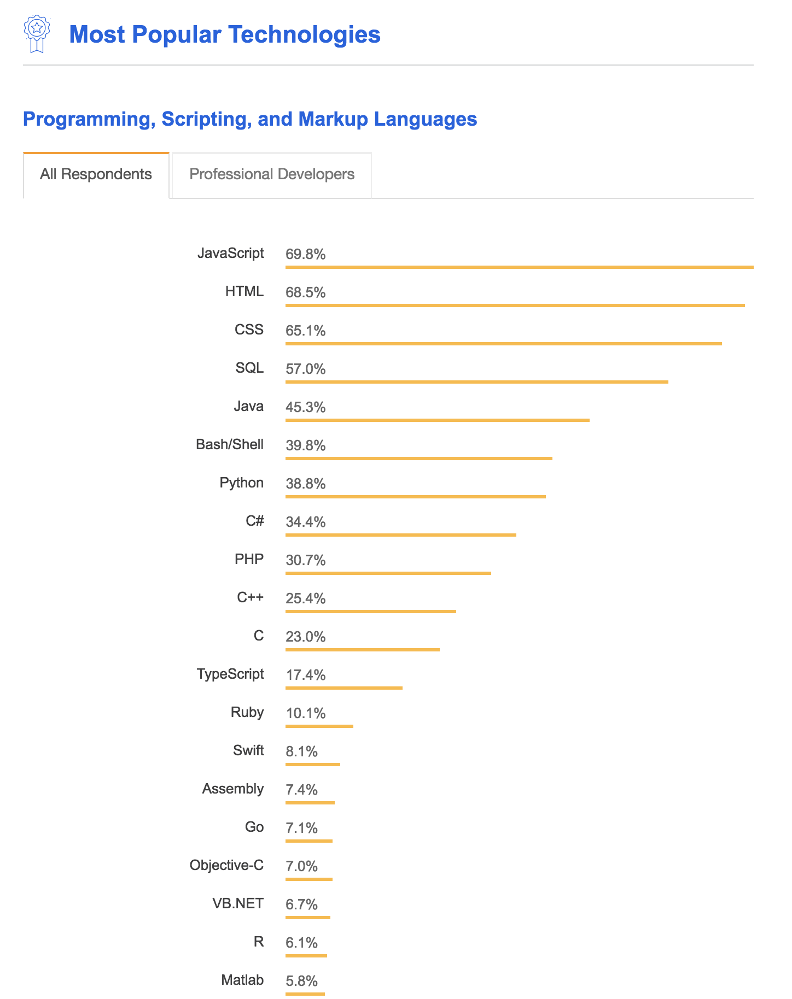
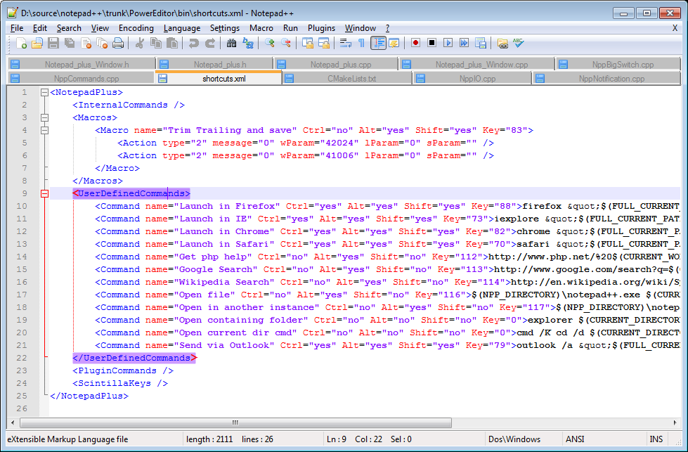

footer: © NodeProgram.com, Node.University and Azat Mardan 2018
theme: Simple, 1
build-lists: true

[.slidenumbers: false]
[.hide-footer]

# State of Javascript: Overview of recent ECMAScript standard and libraries (end of 2018, early 2019)


Azat Mardan Twitter: @azatmardan


---

# Meet Your Presenter: Azat Mardan

* Author of 18 books and over 20 online courses, taught over 500 engineers in-person and over 25,000 online (Udemy and Node University)
* Likes FinTech, blockchain and his coffee :coffee: with coconut oil
* Works as a Sr. SE Manager at Indeed, ex-Tech Fellow at Capital One
* #239 most active GitHub contributor in the world
* Microsoft Most Valuable Professional

---



---

## In the beginning...

---

# DHTML

```js
document.getElementById('main').style.borderLeft = '2px dashed red';
document.getElementById('main').style.color = '#ff0000';
document.getElementById('nav').style.left = 300;
```

---

## Dreamweaver and other WYSIWYGs


---


---


---


---

# Now things are better...


---

[.autoscale:true]

## Or not?

* import vs. require
* Webpack vs. Gulp
* React vs. Angular
* Vue vs. pReact
* TypeScript vs. Flow
* npm vs. yarn
* Semicolons vs. no semicolons

---

# How it feels to learn JavaScript now


^Source: <https://hackernoon.com/how-it-feels-to-learn-javascript-in-2016-d3a717dd577f>


---

# Min max

## I'm here to help! Let me give you the absolute minimum you need to know in 30 min or less

---

# Stack Overflow survey 2017

* Over 64,000 developers
* 72% Web developers
* 63% Full stack web developers


^ [Stack Overflow Developer Survey Results 2017](https://insights.stackoverflow.com/survey/2017#technology)


---

# Stack Overflow survey 2018

* Over 100,000 developers
* JavaScript increase from 62.5% to 69.8%



^ [Stack Overflow Developer Survey Results 2018](https://insights.stackoverflow.com/survey/2018#technology)

---
# ES2015 (a.k.a. ES6) - only important

* Fat arrow functions
* Promises
* Object literals
* Classes
* Modules (import)

---

# ES2016 and ES2017 (ES7 and ES8) - only important

* Async await functions
* Trailing commas in functions

---

# Learn ECMAScript more in depth

Blog posts:

* <https://webapplog.com/es6/>
* <https://node.university/blog/498412/es7-es8>

Courses

* <https://node.university/p/es6>
* <https://node.university/p/es7-es8>

---

# Presets? Compatibility?

<https://kangax.github.io/compat-table/es6/>

Include specific features ✅ by targets with `@babel/preset-env`:

```bash
npm install @babel/preset-env --save-exact
```

```json
{
  "presets": ["env"]
}
```

---

## JS Flavors

* CoffeScript v2
* TypeScript
* Elm
* ClojureScript

---

## State Management

* Redux
* Mobx
* Relay

---

## CSS

* SASS/SCSS
* LESS
* CSS Modules
* Aphrodite

^TL;DR Love inline approach for React. SASS/SCSS is the dominant framework.CSS Modules are probably worth looking into as well.

---

## Frameworks

* React (or preact or inferno)
* Angular 4
* Vue
* Ember
* Backbone

---

## Angular vs. React

---

## React vs. pReact

---

## API

* REST API
* GraphQL (Apollo or Relay)
* Firebase
* Falcor
* Meteor


---

## Testing

* Mocha
* Jasmine
* Enzyme
* Jest
* Cucumber
* Ava

---

# Webpack and Hot Module Reloading

^not live reloading

---

# Enterprise app + Strong Typing = ♥️

Benefits:

* Static analysis, a.k.a. type checking (IDEs and build tools)
* Better, safer code reuse

---

# Which to use

## Flow has less intrusive syntax and easier to integrate while TypeScript is more mature and robust

Get started:

* For Angular, use [TypeScript](https://www.typescriptlang.org)
* For React, use [Flow](https://flow.org)

---

# Stop using Notepad ++

Seriously! 😏



---

## Get VS Code

<https://code.visualstudio.com>

* Smart autocomplete
* Debugger
* Git
* Terminal
* Quick, extendable and customizable

---

## Node

* `util.promisify`
* Chakra instead of Chrome V8
* http2
* v8 + npm v5
*  Large mainstream and enterprise adoption

---

[.autoscale:true]

## How Organizations use Node

* Back-end 73%
* Full stack 61%
* Front-end 51%
* DevOps 22%
* Desktop apps 20%
* Mobile 18%
* Security 8%

^ [2017 USER SURVEY EXECUTIVE SUMMARY](https://nodejs.org/static/documents/casestudies/Nodejs_2017_User_Survey_Exec_Summary.pdf)

---


---

## ES2018

The following feature is currently at stage 4:

* Lifting template literal restriction
* s (dotAll) flag for regular expressions	Mathias Bynens
* RegExp named capture groups
* Rest/Spread Properties
* RegExp Lookbehind Assertions
* RegExp Unicode Property Escapes	Mathias Bynens
* Promise.prototype.finally
* Asynchronous Iteration

^<https://github.com/tc39/proposals>

---

[.autoscale:true]

## ES.Next (Stage 3)

The following features are currently at stage 3:

* Function.prototype.toString revision
* global
* import()
* Legacy RegExp features in JavaScript
* BigInt
* import.meta
* Private instance methods and accessors
* Array.prototype.{flat,flatMap}

---

## ES.Next (Stage 3) CONT.

* Class Public Instance Fields & Private Instance Fields
* Static class fields and private static methods
* String.prototype.{trimStart,trimEnd}
* String.prototype.matchAll
* Symbol.prototype.description
* Object.fromEntries

^Talk about class fields, import(), global, finally

---

## Roadmap to becoming a React developer in 2018

<https://github.com/adam-golab/react-developer-roadmap>

---


---

## Increasing automation of jobs

* Commodity programmers and consumers of frameworks and services
* Top-notch experts and authors of frameworks and services

<https://insights.stackoverflow.com/survey/2018/#technology-a>

---

## AVOID being replaced by automation!

* Continue learning
* Niche out and focus (80/20)
* Be financially wise (don't depends just on one salary)

---

# Summary

* Learn ES.Next
* Use Webpack and Hot Module Reloading
* Add Flow, Redux, React Router to React if needed
* Consider Vue instead of Angular
* Use Node 10 or at least Node 8, it's faster (and Node 10 has worker threads)
* Switch to VS Code
* Adopt async functions or just use callbacks


---

# Summary CONT.

* JavaScript was a toy language
* It spread to other platforms
* It conquered web, i.e., all software
* It's used by startups and enterprises
* It's becoming feature-rich

---

## The future is bright

If can be written in JavaScript, it will be written in JavaScript. If you can pick only one language, with JS you can do so much more:

* Mixed Reality (VR and AR)
* Blockchain and dapps
* Mobile and desktop
* IoT
* Cloud and databases


---

# **AVOID being replaced by automation!**

---

# THE END

## Links

* <https://github.com/azat-co/state-js>
* <http://azat.co>
* <https://webapplog.com>
* <https://node.university>


